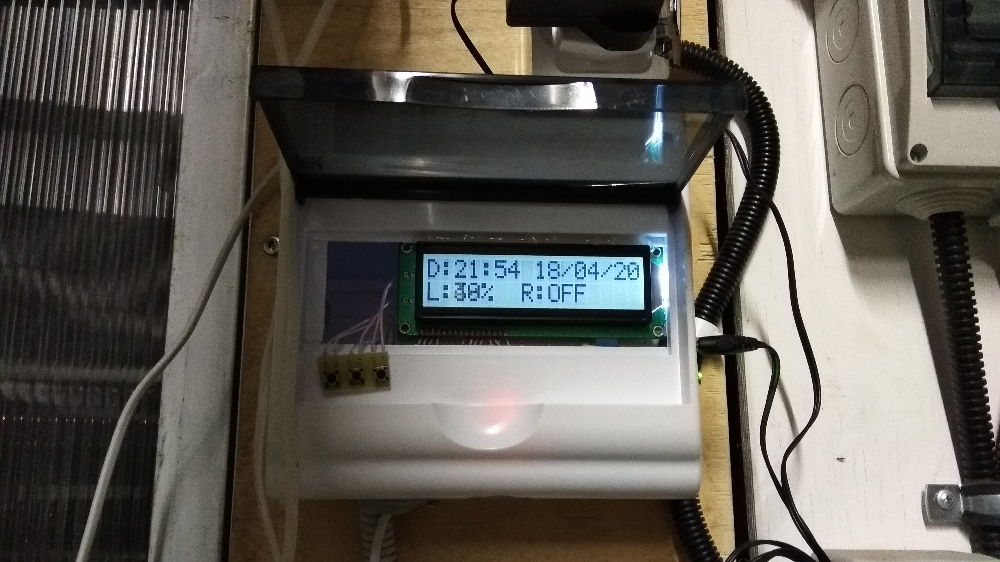
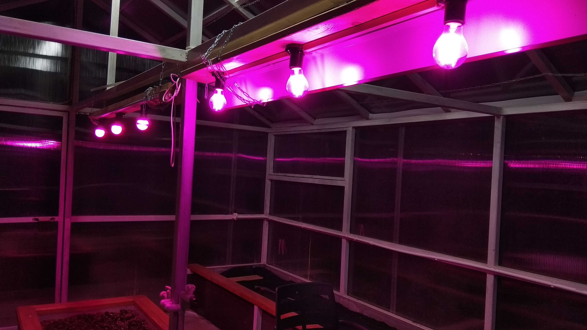

## Программное обеспечение автоматической системы ультрафиолетового освещения теплицы.

**Компоненты системы**:
- Arduino Nano;
- ЖК-дисплей 16х2;
- RTC DS1307;
- Реле на 10А, управляющее двумя розетками, к которым подсоеденины рейки с фитолампами;
- Фоторезистор;
- Пьезопищалка;
- 3 кнопки;
- Не слишком нужный но исторически оказавшийся в схеме зелёный светодиод.
-------------------------------------------------------------------------

**Логика работы**
>Система оперирует понятием сеанса досветки: утреннего и вечернего. Сеанс характеризуется начальным и конечным временем,
пороговым значением освещённости и статусом активности.

Если текущее время находится между начальным и конечным временем какого-либо из активных сеансов, и уровень освещённости
меньше либо равен пороговому для данного сеанса, то реле включается. Если же текущее время находится вне временных
рамок сеансов, то есть сейчас ни один сеанс не идёт, реле выключается. При этом есть возможность переключать реле вручную
кнопкой. Ручное переключение реле не конфликтует с автоматическим.

---------------------------------------------------------------------------------------------------------------------------

**Пользовательский интерфейс** системы состоит из следующих меню:
- Главного меню;
- Меню выбора настроек;
- Меню выбора сеансов для последующей настройки;
- Меню настройки сеанса;
- Меню настройки часов реального времени.

Смена меню реализована с помощью паттерна *Состояние*: меню являются состояниями пользовательского интерфейса.

Переключение пунктов меню и настройка числовых значений производится нажатиями на кнопки. 
В случае с настройкой значений, если удерживать кнопку, то работает автоповтор нажатия. 
Это экономит механический ресурс кнопок.

---------------------------------------------------------------------------------------------------------------

>Поскольку программная экосистема Arduino не является потокобезопасной, нужно было выключить вытесняющую многозадачность
FreeRTOS и работать в кооперативной. Однако поскольку в библиотека Arduino_FreeRTOS имеет свои настройки FreeRTOS
по-умолчанию, которые в данной ситуации не подходят, её потребовалось установить в каталог компонентов
проекта `lib/`, а не в стандартный каталог для библиотек platformio, чтобы изменения в настройках попали в репозиторий.
